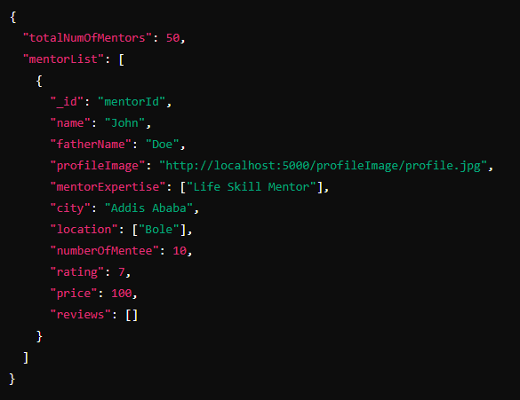

**Api Documentation**

**GET /mentors**

**Description:** Fetch a paginated list of mentors, sorted by the number of mentees in ascending order.

**Request:**

-   **Method:** GET
-   **URL:** /mentors
-   **Headers:** Authorization: Bearer \<JWT Token\>
-   **Query Parameters:**
    -   page (optional): Page number, defaults to 1.
    -   limit (optional): Number of mentors per page, defaults to 3.

**Response:**

-   **200 OK:**
    -   **Response Body:**

        

